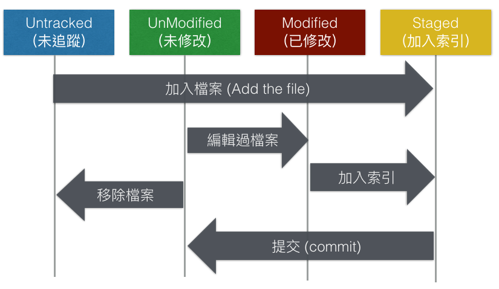

# Git

- Git 是對資料夾做版本管理的工具

  
  
  

- [Git 官方下載](https://git-scm.com/download/win)

- [Git 官方文件說明](https://git-scm.com/book/zh-tw/v2)

## 常用指令

- 查看版本： `git --version`
- 一開始 config 要做的：

    ```linux
    git config --global user.name "roberthsu"
    git config --global user.email scchang@gmail.com
    ```

- 查看目前 cofnig 狀態：`git config -l`或`git config --list`
- 初始化：`git init`。把資料夾納入 git 管理, 會在資料夾中產生 .git
- 查看Git倉庫目前狀態：`git status`
- 將檔案加入追蹤：`git add .`
- 提交版本至本機：`git commit`
- 提交版本至Github：`git push`
- 從 github 下載一全新的 repository 至本機：`git clone`
- 本機已有 repository, 從 Gihub 更新至本機：`git pull`
- 取消 git 管理：`rm`
