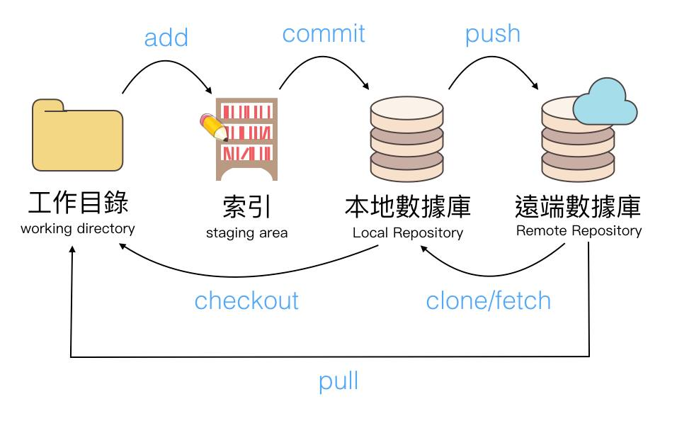

# Git

Git 是對資料夾做版本管理的工具


  


[Git 官方下載](https://git-scm.com/download/win)

[Git 官方文件說明](https://git-scm.com/book/zh-tw/v2)

## 常用指令

查看版本：
```
git --version
```
一開始 config 要做的：

```
git config --global user.name "scchang"
git config --global user.email a0928136004@gmail.com
```

查看目前 cofnig 狀態：
```
git config -l
或
git config --list
```
初始化，把資料夾納入 git 管理，會在資料夾中產生 .git 檔：
```
git init
```
查看Git倉庫目前狀態：
```
git status
```
將檔案加入追蹤：
```
git add .
```
提交版本至本機：
```
git commit -m "modified"
```
提交版本至Github：
```
git push
```
從 github 下載一全新的 repository 至本機：
```
git clone
```
本機已有 repository, 從 Gihub 更新至本機：
```
git pull
```
取消 git 管理：
```
rm
```
查看版本記錄：
```
git log

查看最近2筆
git log -2

查看改動情形
git log -p

去掉作者日期訊息，以簡潔方式輸出
git log --oneline

按 q 跳出
```
退回之前的版本
```
git reset --hard <commit-hash>

如果之前已經有push到Github的，需要強制push：
git push origin <branch-name> --force
```