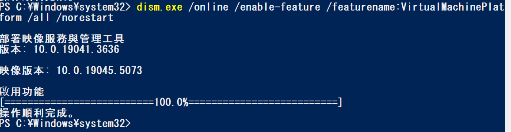
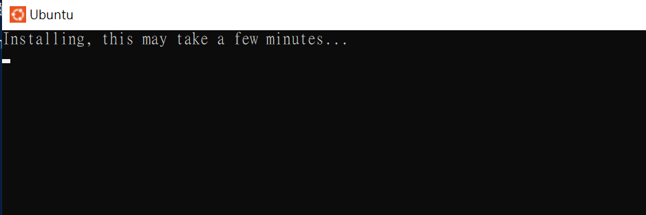

## 建立linux環境
### 以系統管理執行 powershell
### 啟用 Windows 子系統 Linux 版
```
dism.exe /online /enable-feature /featurename:Microsoft-Windows-Subsystem-Linux /all /norestart
```


### 啟用虛擬機器功能
```
dism.exe /online /enable-feature /featurename:VirtualMachinePlatform /all /norestart
```


### 去 microsoft sotre下載安裝 ubuntu


### 啟動ubuntu


## 試寫 GCC C 小程式
- 開啟終端機，執行 nano hello.c 編輯
```
#include<stdio.h>
#include<stdlib.h>
void main(void)
{
    printf("\nHello world!\n\n");
    return;
}
```
- 按`Ctrl +O` (enter寫入),`Ctrl+X`退出
- 執行`gcc -o hello.o hello.c` 編譯
- 執行`./ hello.o`

### 安裝 gcc
- 如果出現找不到 gcc command，就安裝 gcc
```
apt install gcc
```
- 如果出現以下訊息，那就執行`apt-get update`吧，然後再重新執行 `apt install gcc`。
```
  404  Not Found [IP: 2620:2d:4000:1::102 80]
Fetched 54.4 MB in 19s (2917 kB/s)
E: Failed to fetch http://security.ubuntu.com/ubuntu/pool/main/l/linux/linux-libc-dev_6.8.0-45.45_amd64.deb  404  Not Found [IP: 2620:2d:4000:1::102 80]
E: Unable to fetch some archives, maybe run apt-get update or try with --fix-missing?
```
## 試寫Python小程式
### 安裝 python
```
$sudo apt-get update
$sudo apt-get install python3
$python3
```
```
root@DESKTOP-3SQQ6AJ:~# python3
Python 3.12.3 (main, Sep 11 2024, 14:17:37) [GCC 13.2.0] on linux
Type "help", "copyright", "credits" or "license" for more information.
>>> print("Hello world!!!")
Hello world!!!
>>> print("see you again")
see you again
>>>
```
