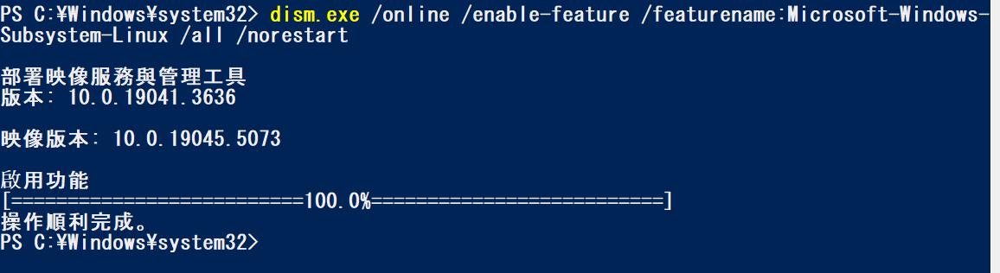
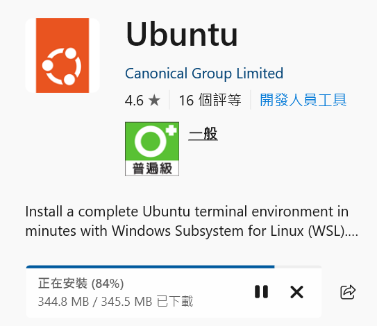
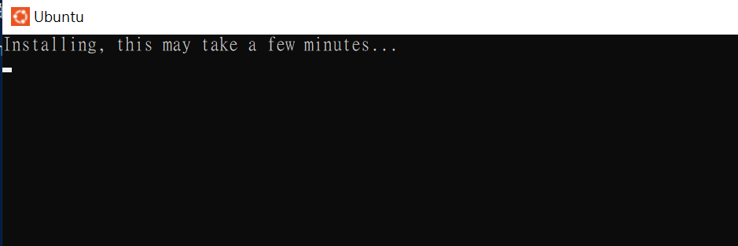

1. 以系統管理執行 powershell
1. 啟用 Windows 子系統 Linux 版
```
dism.exe /online /enable-feature /featurename:Microsoft-Windows-Subsystem-Linux /all /norestart
```

1. 啟用虛擬機器功能
```
dism.exe /online /enable-feature /featurename:VirtualMachinePlatform /all /norestart
```


1. 去 microsoft sotre下載安裝 ubuntu


1. 啟動ubuntu
