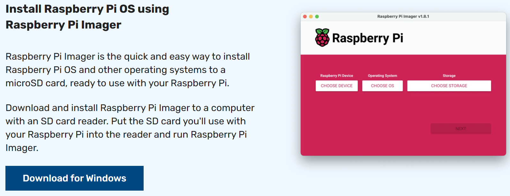
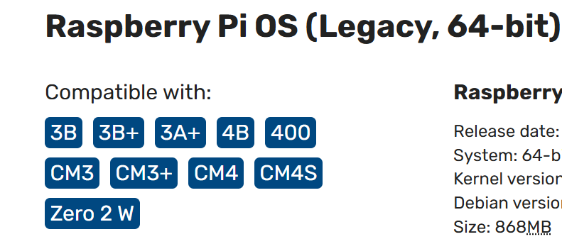
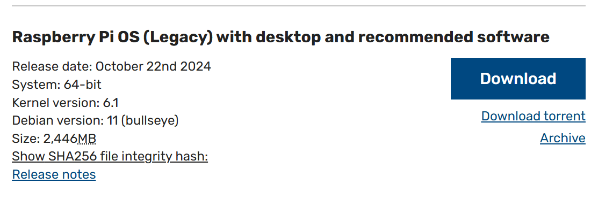
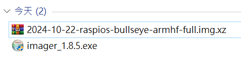
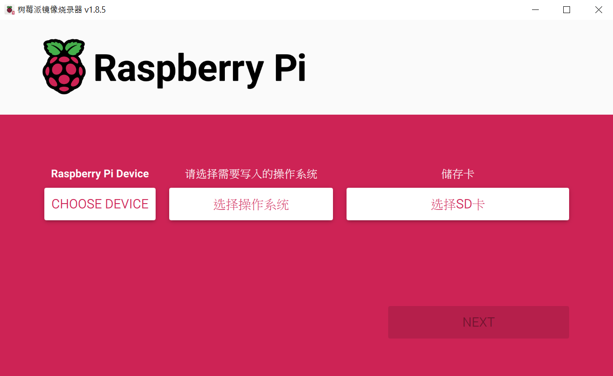
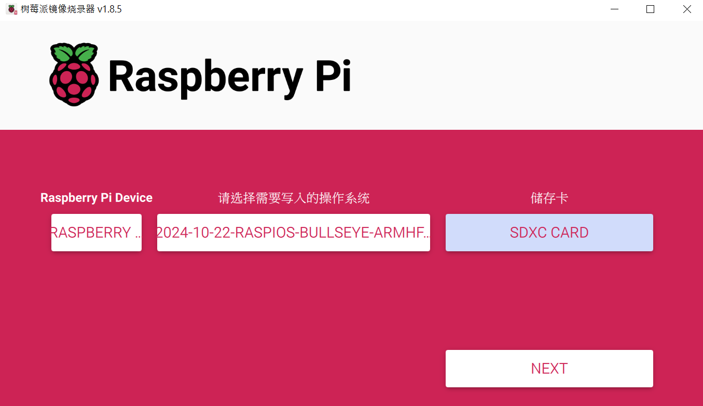
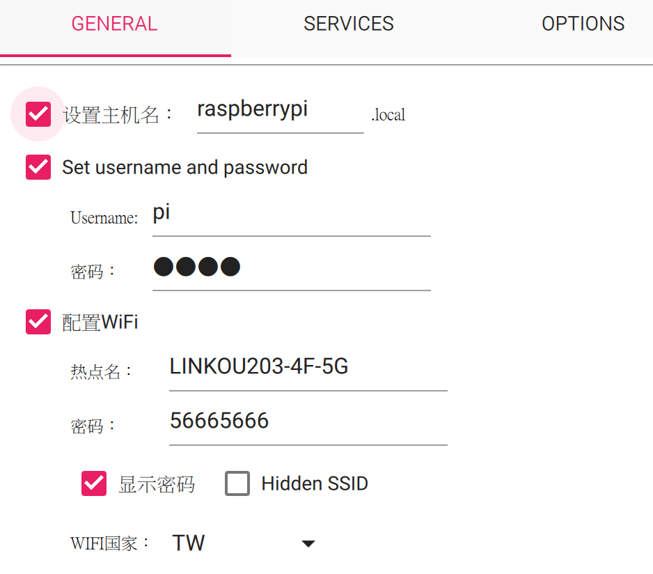
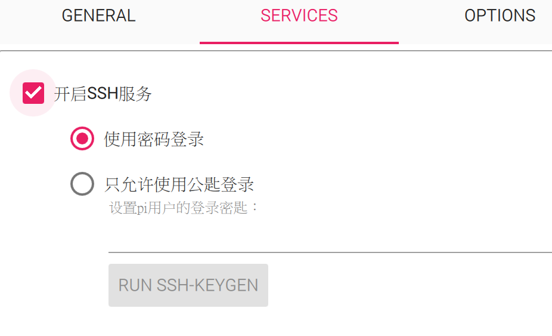
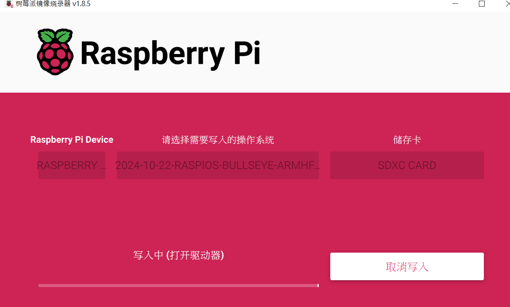

### 在樹莓派安裝作業系統
先到[官網](https://www.raspberrypi.com/software/)，下載 raspberry pi imager 跟相對應的 raspberry pi OS。imager 為安裝 os 的工具，目前我自己的樹梅派是 4B 與職訓局的是 zero2 w。

這是下載 imager


這是下載 4B跟zero2w OS



下載好的檔案


安裝並執行 imager


選擇正確Device跟你下載好的OS檔案，並選擇SD卡路徑，SD卡需事先透過 SD Card Format 工具將SD卡清空。



輯輯設定的部份：
```
主機名：raspberrypiSCC.local
username：pi
password：1234
WIFI 名稱： LINKOU203-4F-5G
WIFI 密碼： 56665666
```

先開啟ssh服務

開始寫入


### 確認是否安裝成功

燒錄完成後，將SD卡拔除，並插到你的樹莓派上開機即可。為了確認是否有安裝成功，用電腦 ping 機器上的主機名稱，看是否有回應：`ping raspberrypiSCC.local`，如有回應表示已安裝成功。

### 啟動 VNC & SSH 服務

如果你有營幕hdmi跟鍵盤滑鼠，你可以接上去，設定 wifi 跟開啟 vnc 及 ssh 的服務。wifi的部份在營幕的右上角，設定好之後，記錄一下你的 ip 位置，再來就是開啟 vnc 及 ssh 服務，到終端機模式下，執行 `sudo raspi-config`，選到 interface，將vnc & ssh enable。或是直接下
```
sudo service ssh start
sudo service ssh status
```
因為我沒有營幕跟鍵盤，所以我一開始編輯設置部份就先將 wifi 熱點跟密碼設定好，並在 service 部份開啟 ssh 功能。以前編輯設置部份並沒有 service部份，全新樹莓派預設系統 ssh 是關閉的，這時可以在SD卡根目錄新增一個`ssh`的空白文件就可以打開ssh了。

### 使用 SSH 登入樹莓派

剛樹莓派連接營幕時，已將ip記錄起來了，所以ip已經知道了。如果沒有營幕時，可以手機下載 `Net Analyzer`，並且手機與電腦與樹莓派設定相同網域，開始 scan，即可找到樹莓派的 ip。

在電腦的任何命令列(cmd/ powershell/ Gitbash)執行：`ssh pi@192.168.1.118`即可登入樹莓派，或是使用 putty，直接輸入 ip 登入。

### 使用 VNC Viewer 達到遠端桌面功能

我們之前已將 VNC 服務打開了，所以我們可以在電腦上執行 VNC 即可連到樹莓派遠端桌面了。
